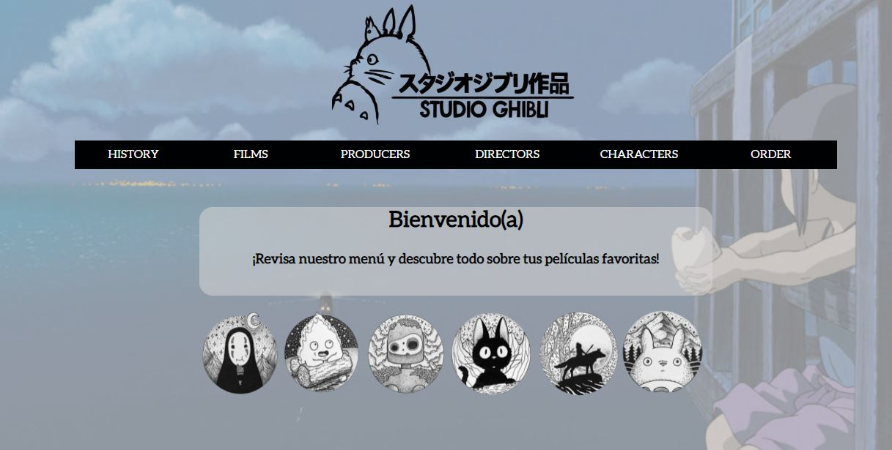
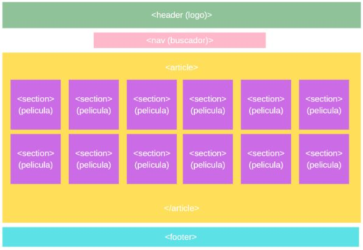
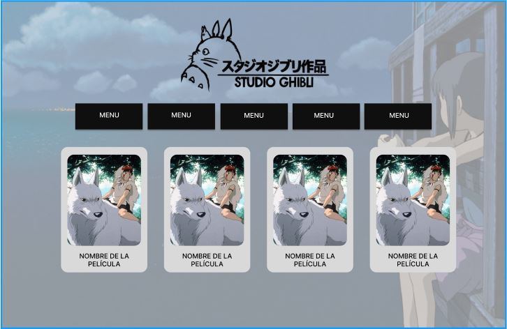
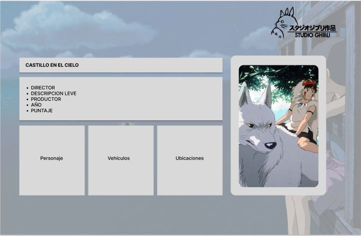
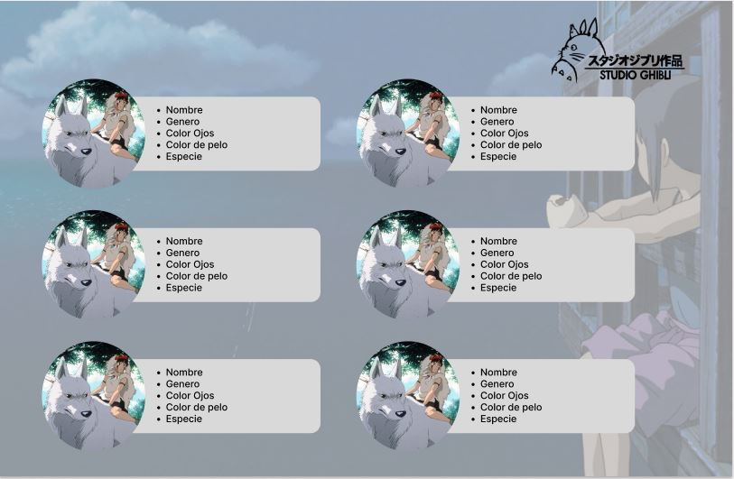

# Data Lovers

## Índice

* [1. Definición del producto](#1-definición-del-producto)
* [2. Historias de usuario](#2-historias-de-usuario)
* [3. Diseño de la Interfaz de Usuario](#3-diseño-de-la-interfaz-de-Usuario)
* [4. Link a Zeplin](#4-link-a-zeplin)
* [5. Listado de problemas](#5-listado-de-problemas)

***

## 1. Definición del producto
Studio Ghibli es un estudio de animación japonés, conocido por sus largometrajes animados como Mi vecino Totoro, El viaje de Chihiro o El castillo ambulante, entre otros grandes éxitos. Las animaciones tienen gran acogida a nivel mundial y algunas han recibido varias nominaciones y premios. De todo este fandom hay un grupo que desea poder interactuar y ver la información de las animaciones y sus personajes.
Para este proyecto realizamos prototipos de diseño enfocados en las necesidades de los fans en Figma, con colores contrastantes al logo de Studios Ghibli.Esta aplicación web entrega al usuario una serie de funcionalidades que le permite por ejemplo, conocer cuántas animaciones y cúales son, diferenciar qué productores y directores han colaborado en la creación de más de una animación,información relevante para nuestras usuarias, como descripción, puntaje, director, productor y personajes.Además, se muestran características únicas de los personajes como nombre, edad, género, especie, etc. 

La aplicación web incia con un mensaje de bienvenida que invita a interactuar con el menú según lo que necesite el usuario.
 

## 2. Historias de usuario

#### 1.-Historia de Usuario: 
* "Como fans de Studios Ghibli" quiero ver todas las películas estudios Ghibli con su puntuación e imagen"
#### Criterios de Aceptación:
* Que sea responsive Que se vea la imagen de la película, el nombre y la puntuación.
* Que no haya interacción, sólo se muestre en pantalla.
#### Definición de terminado
* Todo el código está subido a la rama principal del repositorio.
* Publicado en Github pages.

#### 2.- Historia de Usuario: 
* "Como fans quiero poder filtrar mis peliculas de acuerdo a los productores encargados en Studio Ghibli"
#### Criterios de Aceptación:
* Que sea responsive
* Que haya una lista desplegable con opciones de productor
* Que se filtren y muestren las péliculas según el productor seleccionado
#### Definición de terminado
* Todo el código está subido a la rama principal del repositorio.
* Publicado en Github pages

#### 3.- Historia de Usuario:
* "Como fans quiero poder filtrar mis peliculas de acuerdo a los directores encargados en Studio Ghibli"
#### Criterios de Aceptación:
* Que sea responsive
* Que haya una lista desplegable con opciones de directores.
* Que se filtren y muestren las péliculas según el director seleccionado.
#### Definición de terminado
* Todo el código está subido a la rama principal del repositorio.
* Publicado en Github pages

#### 4.-Historia de Usuario:
* "Como fans quiero leer una historia breve de los Estudios Ghibli"
#### Criterios de Aceptación:
* Que sea responsive
* Que se muestre una imagen y un texto resumen sobre Estudios Ghibli.
#### Definición de terminado
* Todo el código está subido a la rama principal del repositorio.
* Publicado en Github pages

#### 5.-Historia de Usuario:
* "Como fans quiero ver las un resumen de las características de mi película favorita"
#### Criterios de Aceptación:
* Que sea responsive
* Que al elegir una película se muestre su nombre, descripción general, director, productor, año lanzamiento, puntaje, personajes.
#### Definición de terminado
* Todo el código está subido a la rama principal del repositorio.
* Publicado en Github pages

#### 6.- Historia de Usuario:
* "Como fans quiero filtrar los personajes de mi película favorita"
#### Criterios de Aceptación:
* Que sea responsive
* Que se muestre un lista deplegable con las opciones de película.
* Que al hacer click en la película seleccionada se muestren los personajes y sus características principales.
#### Definición de terminado
* Todo el código está subido a la rama principal del repositorio.
* Publicado en Github pages

#### 7.- Historia de Usuario:
* "Como fans quiero ordenar las películas de los Estudios Ghibli de orden ascendente y descendente"
#### Criterios de Aceptación:
* Que sea responsive.
* Que muestre un botón con dos opciones de ordenado de la A-Z y Z-A.
* Que al hacer click se ordenen según la opcion selecionada.
#### Definición de terminado
* Todo el código está subido a la rama principal del repositorio.
* Publicado en Github pages

## 3. Diseño de la Interfaz de Usuario

### Prototipo de baja fidelidad

### Prototipo de alta fidelidad

 

## 4. Link a Zeplin

* El proyecto será entregado subiendo tu código a GitHub (commit/push) y la
  interfaz será desplegada usando [GitHub Pages](https://pages.github.com/).

## 5. Listado de problemas

* En la historia de usuario 5 se quitaron algunas características de las películas, debido a que quedaba muy cargada visualmente esa sección.

## 9. Checklist

* [ ] Usa VanillaJS.
* [ ] Pasa linter (`npm run pretest`)
* [ ] Pasa tests (`npm test`)
* [ ] Pruebas unitarias cubren un mínimo del 70% de statements, functions y
  lines y branches.
* [ ] Incluye _Definición del producto_ clara e informativa en `README.md`.
* [ ] Incluye historias de usuario en `README.md`.
* [ ] Incluye _sketch_ de la solución (prototipo de baja fidelidad) en
  `README.md`.
* [ ] Incluye _Diseño de la Interfaz de Usuario_ (prototipo de alta fidelidad)
  en `README.md`.
* [ ] Incluye link a Zeplin en `README.md`.
* [ ] Incluye el listado de problemas que detectaste a través de tests de
  usabilidad en el `README.md`.
* [ ] UI: Muestra lista y/o tabla con datos y/o indicadores.
* [ ] UI: Permite ordenar data por uno o más campos (asc y desc).
* [ ] UI: Permite filtrar data en base a una condición.
* [ ] UI: Es _responsive_.
